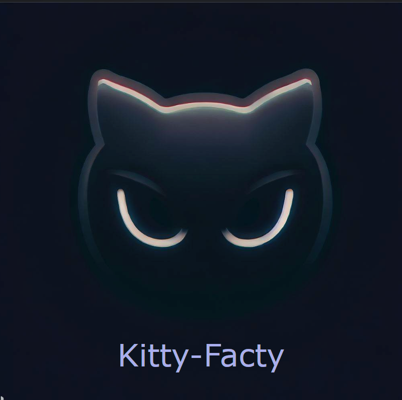
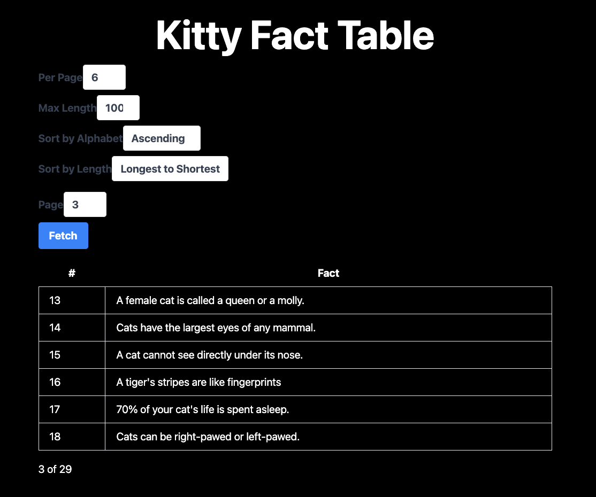

# Kitty Facty - The Ultimate Kitty Fact Finder



Kitty Facty is a simple web application that allows users to browse cat facts. It is built using Next.js and TypeScript. It has the following features:

- Pagination of cat facts.
- Sorting of cat facts by length, alphabetically or by length.
- Caching of cat facts to reduce the number of API calls.
- Error handling in case something goes wrong with the Cat Fact API.

## Built With

- [Typescript](https://www.typescriptlang.org/)
- [Next.js](https://nextjs.org/)

## Demo

A live demo of the application can be found [here](https://kitty-facty.vercel.app/).



## Quick Start 🚀

The quickest way to get started is to run the latest version of the application using [Docker](https://www.docker.com/). To do this, follow these steps:

- Pull the latest image from Docker Hub: `docker pull teezzan/kitty-facty:latest`
- Start the Docker container: `docker run -p 3000:3000 teezzan/kitty-facty:latest`

Viola! The application is now running on your local machine. You can now access it at `http://localhost:3000`.

## Getting Started

This application can be deployed locally by the following ways.

- Using [Docker](https://www.docker.com/)
- Using the local environment.

### Prerequisites

To run the application on your local computer, you need to have the following installed:

- [Node.js](https://nodejs.org/en/)
- [Make](https://www.gnu.org/software/make/)
- [Docker](https://www.docker.com/) (optional)

While you don't need an `.env` file to run the application, it is the means by which you can chnage the default values for the application. A sample .env file named `.env.example` is provided. You can make a copy, rename it to `.env`, and update the values as needed.

### Docker

- Clone the repository and navigate to the project directory:

```bash
git clone https://github.com/teezzan/kitty-facty.git
cd kitty-facty
```

- Build the Docker image:

```bash
make build
```

- Run the Docker container:

```bash
make docker-up
```

### Local Environment

To deploy the application locally, follow these steps:

- Clone the repository: `git clone https://github.com/teezzan/kitty-facty.git`
- Navigate to the project directory: `cd kitty-facty`
- Install dependencies: `make install`
- Start the local server: `make serve`

## Makefile

To view the available make commands, run make help.

```bash
------------------------------------------------------------------------
kitty-facty
------------------------------------------------------------------------
serve                          Run locally
build                          Build application binaries
lint                           Run linters
test                           Run unit tests
image                          Create Docker image
docker-up                      Start docker image
install                        Install dependencies
help                           Show this help
```

## Project Structure

The project is structured as follows:

- `pages`: Contains the Next.js pages for the application.
- `styles`: Contains global styles for the application.
- `clients`: Contains the client for the Cat Fact API.
- `utils`: Contains utility functions for the application.
- `interfaces`: Contains interfaces and constants used throughout the application.
- `config`: Contains default values and environment-specific configuration.
- `__tests__`: Contains unit tests for the application.

## API Documentation

**`GET /api/facts`**

Returns a list of cat facts based on the provided query parameters.

### **Query Parameters**

The following query parameters are supported:
| Query String Parameter | Description | Example |
| ---------------------- | ----------- | ------- |
| `perPage` | Number of facts to return per page. Default is `DEFAULT_FACTS_PER_PAGE`. | `perPage=25` |
| `page` | Page number to return. Default is `DEFAULT_FACTS_PAGE`. | `page=3` |
| `sortByLength` | Sort facts by length. Enumerated values: `asc` (ascending) or `desc` (descending). | `sortByLength=desc` |
| `sortByAlphabet` | Sort facts alphabetically. Enumerated values: `asc` (ascending) or `desc` (descending). | `sortByAlphabet=asc` |
| `maxLength` | Maximum length of the returned facts. default is `DEFAULT_FACTS_MAX_LENGTH`| `maxLength=100` |

Note that the `sortByLength` and `sortByAlphabet` query parameters are mutually exclusive. If both are provided, the `sortByLength` parameter will take precedence.

All parameters are optional.
All default values are defined in `src/config/defaultValues.ts` and can be overridden by environment variables.

### **Sample Request**

```bash
GET /api/facts?perPage=3&page=21&sortByLength=desc&sortByAlphabet=asc&maxLength=100
```

### **Sample Response**

```javascript
HTTP/1.1 200 OK
Content-Type: application/json

{
    "currentPage": 21,
	"perPage": 3,
	"totalPages": 58,
    "facts": [
        {
			"fact": "A cat's hearing is much more sensitive than humans and dogs.",
			"length": 60,
			"id": 1
		},
		{
			"fact": "In 1987 cats overtook dogs as the number one pet in America.",
			"length": 60,
			"id": 2
		},
		{
			"fact": "Neutering a cat extends its life span by two or three years.",
			"length": 60,
			"id": 3
		}
    ]
}

```

## Testing

To run tests:

```bash
make test
```

## License

This project is licensed under the MIT License. See the LICENSE file for more information.

## Authors

**[Taiwo Yusuf](https://github.com/teezzan/)**
